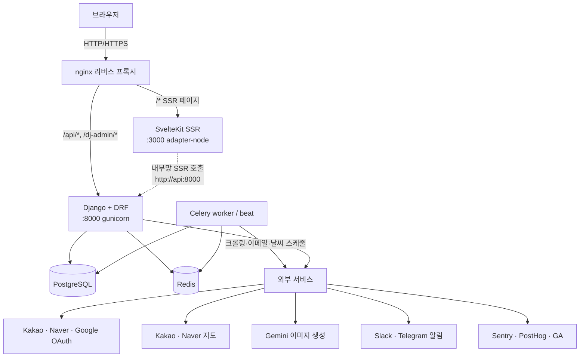
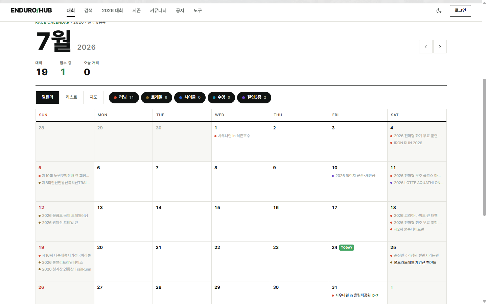
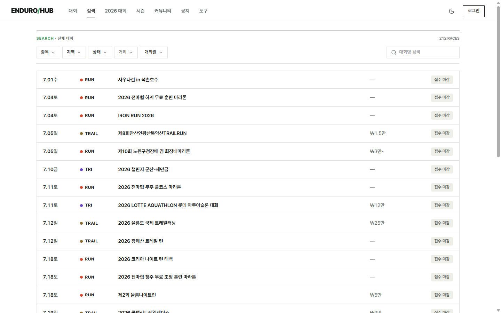
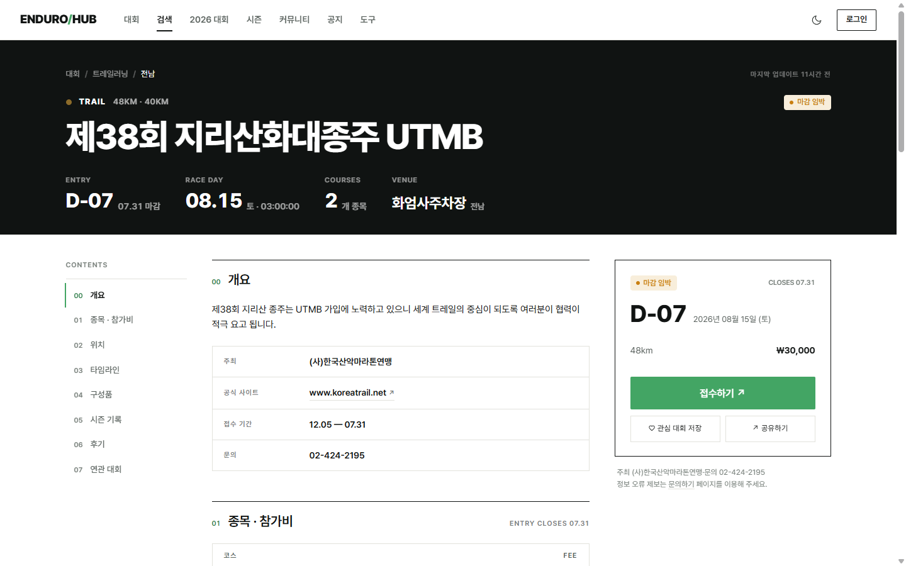
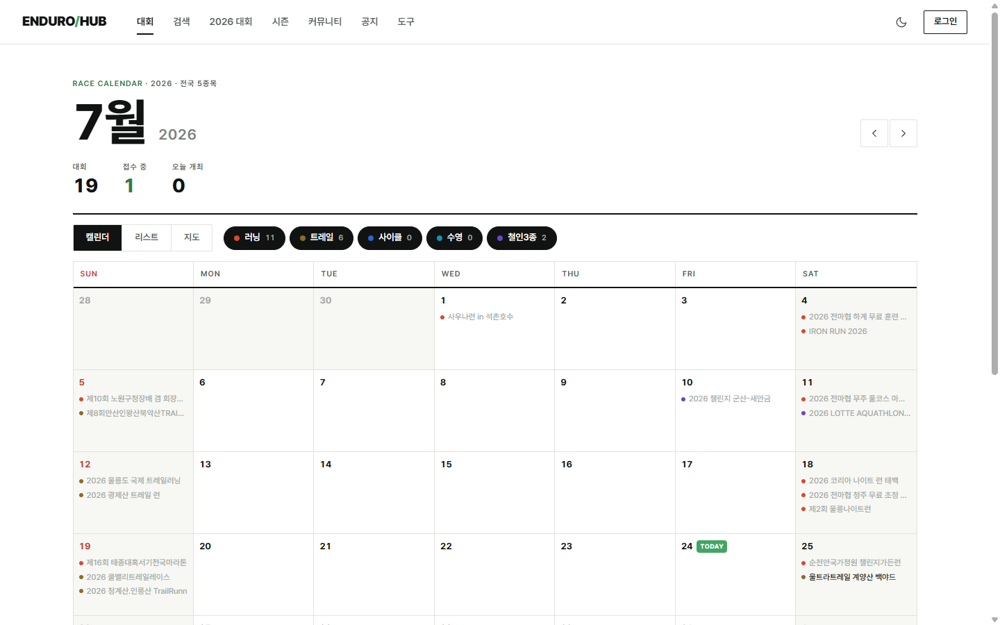
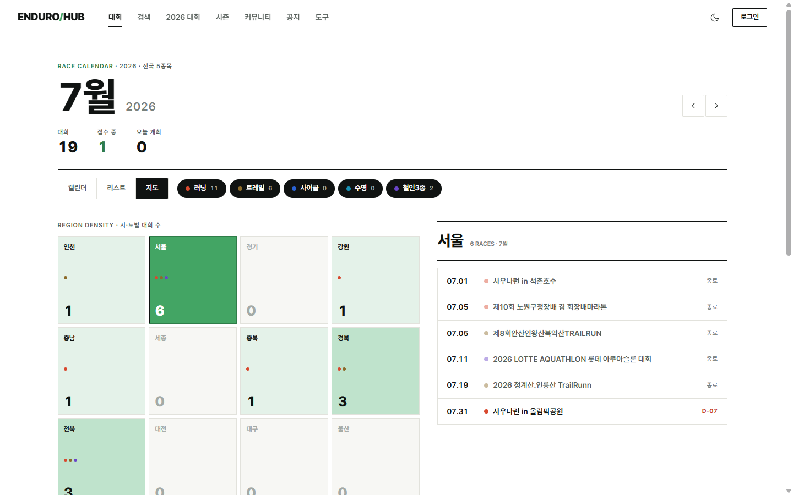
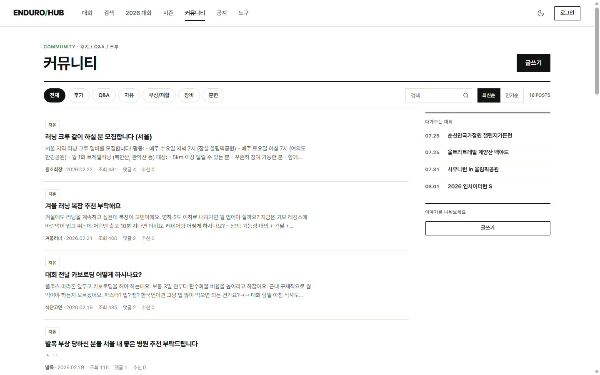
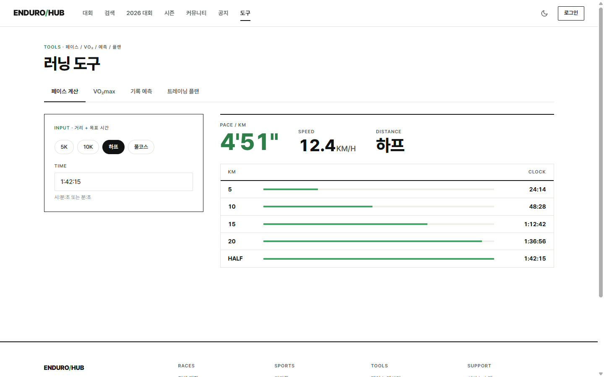
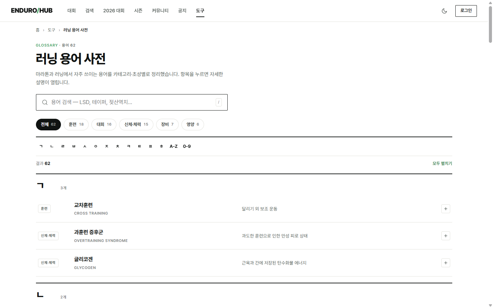
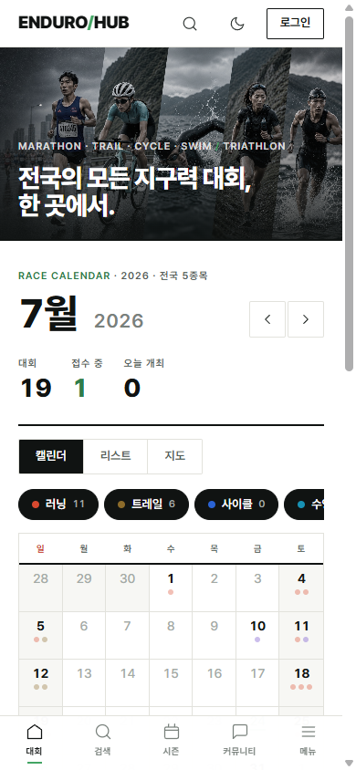

# 엔듀로허브 (EnduroHub)

> **국내 지구력 스포츠 대회 정보 플랫폼** — 마라톤·수영·자전거·철인3종·트레일러닝 대회를 한곳에서.

🔗 **라이브 서비스: [www.endurohub.kr](https://www.endurohub.kr)**

`Django 5` · `DRF` · `SvelteKit 5 (SSR)` · `Svelte 5` · `PostgreSQL` · `Celery` · `Docker` · `nginx`

---

## 한눈에 보기

엔듀로허브는 전국에서 열리는 지구력 스포츠 대회 정보를 자동으로 수집·정제해 제공하고,
참가자들이 후기를 남기고 정보를 나누는 커뮤니티와 러닝 훈련 도구까지 갖춘 **프로덕션 서비스**다.

**Django 5 REST API + SvelteKit 5 SSR** 아키텍처로, 자동 크롤링과 사람 검수를 결합한
대회 데이터 파이프라인을 갖췄다.

| 구분 | 내용 |
|---|---|
| **종류** | 대회 정보 카탈로그 + 커뮤니티 + 러닝 도구 |
| **종목** | 마라톤 · 수영 · 자전거 · 철인3종 · 트레일러닝 (5종) |
| **규모** | 운영 중인 실서비스, 자동 크롤링으로 대회 데이터 상시 갱신 |
| **구조** | 모노레포 (`api/` Django · `web/` SvelteKit · `nginx/` 리버스 프록시) |
| **배포** | Docker Compose + GitHub Actions (셀프호스티드 러너, 변경 감지 선택적 재빌드) |

---

## 아키텍처

클라이언트 요청은 nginx가 받아 경로에 따라 Django API와 SvelteKit SSR 서버로 나눠 보낸다.
SvelteKit은 SSR 단계에서 내부 네트워크로 Django API를 직접 호출하고(`http://api:8000`),
브라우저의 클라이언트 호출은 nginx가 `/api/*`로 프록시한다 (**이중 네트워킹**).

**컨테이너 구성 (docker-compose)**

| 서비스 | 역할 |
|---|---|
| `api` | Django + DRF (gunicorn, 4 worker / 2 thread) |
| `celery-worker` | 백그라운드 작업 처리 (크롤링·이메일·이미지) |
| `celery-beat` | 스케줄 작업 트리거 |
| `web` | SvelteKit SSR (Node adapter, body limit 20MB) |
| `nginx` | 리버스 프록시 + 정적/미디어 서빙 |

> PostgreSQL과 Redis는 호스트(외부)에 두고 `host.docker.internal`로 연결한다.

**nginx 라우팅 요약**

| 경로 | 대상 |
|---|---|
| `/api/*` | Django REST API |
| `/dj-admin/*` | Django 어드민 (unfold) |
| `/static/`, `/storage/` | Django 정적 자원 · 업로드 미디어 (30일 캐시) |
| `/_app/immutable/*` | SvelteKit 불변 자산 (1년 캐시) |
| `/*` | SvelteKit SSR |

---

## 기술 스택

### 백엔드 (`api/`)
- **Django 5.1** + **Django REST Framework 3.15** — REST API
- **PostgreSQL** — 관계형 데이터 저장
- **Celery 5.4 + Redis** — 비동기/스케줄 작업 (django-celery-beat)
- **django-unfold** — 커스텀 어드민 패널
- **djangorestframework-camel-case** — snake_case ↔ camelCase 자동 변환
- **Pillow** (이미지 처리·WebP 변환), **nh3** (HTML 새니타이즈), **PyJWT** (인증)
- **Sentry** + 구조화 JSON 로깅 + Telegram 에러 알림

> 백엔드 구현 상세(앱 구조·모델·API·인증·Celery·크롤러)는 [backend-django.md](backend-django.md) 참고.

### 프론트엔드 (`web/`)
- **Svelte 5.49** (runes: `$state`/`$derived`/`$effect`) + **SvelteKit 2.21** (SSR, adapter-node)
- **Tailwind CSS 4** + **daisyUI 5** — "Arena" 디자인 시스템 (Oklch 색공간)
- **TipTap 3** — 리치 텍스트 에디터 (게시글·후기 작성)
- **SVG 타일 카토그램** — 시·도별 대회 밀도 지도, **Satori + resvg** — 동적 OG 이미지 생성
- **PostHog** + **Google Analytics** + **Sentry** — 제품 분석·에러 추적

### 인프라
- **Docker Compose** (개발/프로덕션 분리), **nginx**, **GitHub Actions** (셀프호스티드 러너)

---

## 주요 기능

### 🏃 대회 카탈로그
- **다중 필터**: 종목 · 지역(17개 시도) · 거리 · 기간(월 범위 슬라이더) · 접수 상태 + 키워드 검색
- **자동 상태 계산**: 접수 시작/마감·대회일 기준으로 `예정 / 접수중 / 접수마감 / 종료` 및 D-day 자동 산출
- **종목별 거리 자동 분류**: `DISTANCE_CATEGORIES` 규칙으로 종목마다 다른 분류 적용
  - 마라톤: 10km 이하 / 하프 / 풀코스 / 울트라 (`range` 타입)
  - 트레일러닝: 20km 이하 / 21~50km / 울트라
  - 자전거: MTB / 로드 / 그란폰도 / 메디오폰도 (`keyword` 타입)
  - 철인3종: 70.3(하프) / 풀코스, 수영: 1.5km 기준 장·단거리 (`range_m` 타입)
- **즐겨찾기 · 리뷰/평점**: 별점, 완주 기록, 코스 난이도, 운영 만족도, 추천 태그

### 🤖 자동 데이터 수집 + 사람 승인 워크플로우
- `marathon` 크롤러가 외부 대회 정보 사이트를 주기적으로 수집
- **필드 단위 변경 감지** → `RacePendingChange`로 적재 → **관리자가 승인/반려**한 뒤 반영
- 관리자가 수정한 필드는 `locked_fields`로 잠겨 크롤러가 덮어쓰지 못하도록 보호
- → *자동화의 편의*와 *수작업 데이터의 신뢰성*을 동시에 확보

### 💬 커뮤니티
- 게시글 · 댓글(대댓글) · 좋아요, 카테고리별 분류 (자유·대회후기·부상재활·장비·훈련·질문)
- **익명(비밀번호 기반) + OAuth 로그인 병행** — 로그인 없이도 글/댓글 작성 가능
- 게시글에 **대회 태깅**, **TipTap 리치 에디터**(이미지 업로드·서식)
- 좋아요·리뷰는 IP 해시로 중복 방지, 사용자 HTML은 nh3로 새니타이즈

### 🧮 러닝 도구
- **페이스 계산기** (거리·시간·페이스 상호 계산, 1km 구간 분할표)
- **VO2max 계산기** (Daniels VDOT 공식 → 훈련 존 페이스)
- **기록 예측기** (Riegel 모델, 5K~50K 환산)
- **트레이닝 플랜** (8/12/16주, Base→Build→Peak→Taper 주기)
- **러닝 용어 사전** (초성 그룹핑·카테고리 필터·검색·FAQ 구조화 데이터)

### 👤 사용자 · 자동화 · 운영
- **OAuth 로그인** (카카오·네이버·구글) + 온보딩(선호 종목·지역) + 내 기록 + 즐겨찾기 + 이메일 알림 옵트인
- **Celery 스케줄 작업**: 대회 크롤링 · 주간 다이제스트 메일 · 신규 대회 알림 · 날씨 예보 수집
- **동적 OG 이미지** (Satori), **SEO** (JSON-LD: WebSite·ItemList·FAQPage), **분석/모니터링** (PostHog·GA·Sentry)
- **어드민 (django-unfold)**: 이미지 갤러리 드래그 정렬, pending change 일괄 승인, 필드 자동 잠금

---

## 주요 화면

### 홈 (월간 캘린더)
월간 캘린더를 중심으로 한 홈. 이달의 대회 수·접수 중·오늘 개최 요약, 종목 필터 칩,
캘린더/리스트/지도 뷰 전환을 제공하고 오늘 날짜를 마킹한다.

### 대회 검색
종목·지역·상태·거리·개최월을 조합하는 다중 필터와 키워드 검색. 각 행에 날짜·종목·참가비·접수
상태를 함께 보여준다. 종목별 페이지(`/running` 등)는 깔끔한 URL로 같은 목록을 필터링해 보여준다.

### 대회 상세
D-day 카운트다운, 접수 상태, 종목·거리·참가비, 개요·타임라인·시즌 기록·후기·연관 대회로 이어지는
목차형 상세 페이지. 접수하기·관심 대회 저장·공유 액션을 제공한다.

### 캘린더 & 지도
월별 캘린더 그리드와, 한국 지형을 근사한 **시·도 타일 카토그램**에 지역별 대회 수를 밀도로
표시하는 지도 뷰. 지역을 선택하면 해당 월의 대회 목록이 나타난다.

| 월별 캘린더 | 지역 밀도 지도 |
|---|---|
|  |  |

### 커뮤니티
카테고리·검색·정렬을 갖춘 게시판. 로그인 없이도 익명으로 참여할 수 있고,
사이드바에 다가오는 대회를 함께 보여준다.

### 러닝 도구 & 용어 사전
페이스 계산기를 비롯한 4종 러닝 계산기와 러닝 용어 사전.

| 페이스 계산기 | 러닝 용어 사전 |
|---|---|
|  |  |

### 반응형
모바일까지 대응하는 반응형 레이아웃. 하단 탭바 내비게이션과 모바일에 맞춘 캘린더 그리드를 제공한다.

> 디자인 시스템 **"Arena"** — Oklch 색공간 기반 라이트/다크 테마, Space Grotesk(디스플레이) ·
> Pretendard(본문) · IBM Plex Mono(라벨) 타이포그래피, 샤프한 미니멀 스타일.

---

## 기술적 도전 / 하이라이트

- **크롤러 ↔ 수작업 데이터 충돌 방지** — `locked_fields` + `RacePendingChange` 승인 워크플로우로
  자동 수집과 사람 검수를 분리, 운영자가 다듬은 데이터가 크롤링에 덮이지 않도록 설계.
- **SSR + 이중 네트워킹** — SvelteKit이 서버에서는 내부망으로, 브라우저에서는 nginx 프록시로
  같은 API를 호출하도록 `api.ts` / `api.client.ts`를 분리.
- **시각화** — 시·도 타일 카토그램 지도 뷰, Satori 기반 대회별 동적 OG 이미지 자동 생성.
- **종목별 거리 자동 분류** — `range` / `keyword` / `range_m` 3가지 규칙 타입으로
  종목마다 다른 거리 체계(마라톤 km, 수영 m, 자전거 키워드)를 하나의 필터 UI로 통합.

> 주요 결정의 배경과 트레이드오프는 [기술-의사결정.md](기술-의사결정.md) 참고.

---

본 문서의 스크린샷은 라이브 서비스 [www.endurohub.kr](https://www.endurohub.kr)에서 캡처했습니다.
