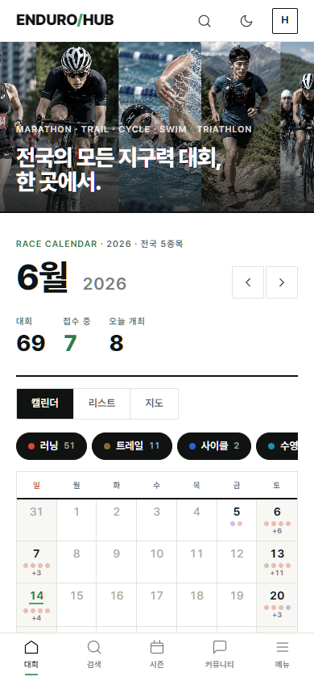
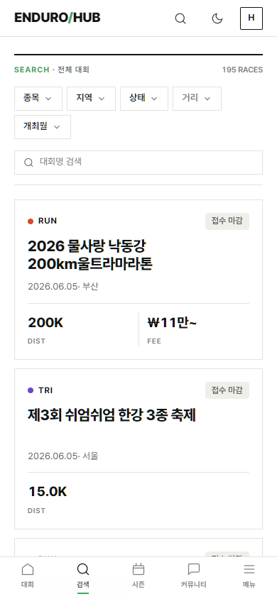
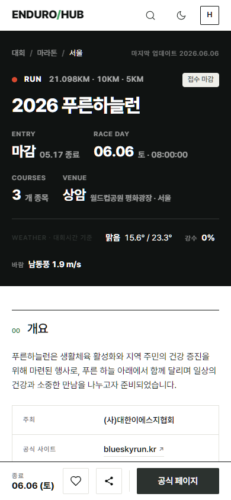
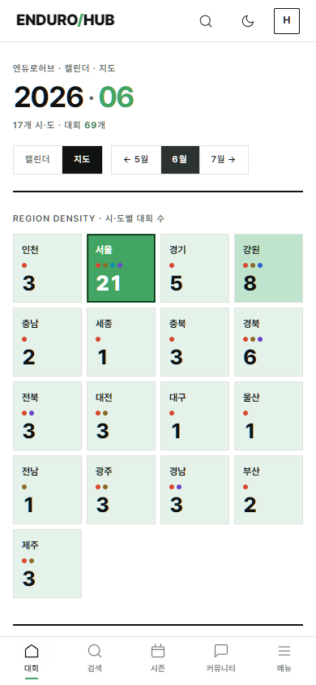
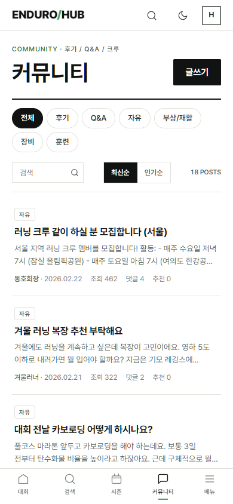
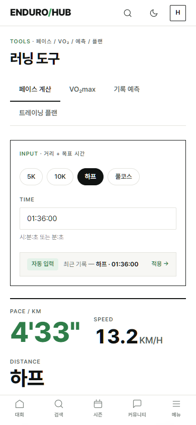
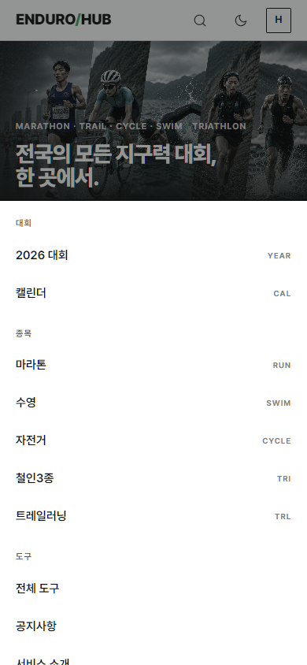

# 사용방법 (모바일)

엔듀로허브는 국내 마라톤·트레일·사이클·수영·철인3종 등 모든 **지구력 대회**를 한곳에 모아 보여 주는 서비스입니다. 모바일에서는 화면 맨 아래 **하단 탭바** 하나로 핵심 기능을 모두 오갈 수 있습니다.

> 하단 탭바: **대회 · 검색 · 시즌 · 커뮤니티 · 메뉴**

---

## 1. 홈에서 이달의 대회 둘러보기 — `대회` 탭

앱을 열면 이번 달 대회 현황이 가장 먼저 보입니다.

- 상단 숫자판에서 **이번 달 대회 수 · 접수 중 · 오늘 개최** 를 한눈에 확인합니다.
- **캘린더 / 리스트 / 지도** 탭으로 보기 방식을 바꿀 수 있습니다.
- **러닝 · 트레일 · 사이클 …** 종목 칩을 눌러 원하는 종목만 걸러 봅니다.
- 좌우 화살표( `‹` `›` )로 이전·다음 달로 이동합니다.

> 💡 화면 우측 상단의 🔍(검색) · 🌙(다크 모드) 아이콘은 모든 페이지에서 항상 떠 있습니다.

---

## 2. 조건으로 대회 찾기 — `검색` 탭

원하는 대회를 조건으로 좁혀서 찾습니다.

- 상단 필터 칩으로 **종목 · 지역 · 상태 · 거리 · 개최월** 을 조합합니다.
- 검색창에 **대회명**을 직접 입력해 바로 찾을 수도 있습니다.
- 결과 카드마다 **종목 태그 · 접수 상태 · 거리(DIST) · 참가비(FEE)** 가 함께 표시됩니다.
- 아래로 스크롤해 페이지를 넘기며 더 많은 대회를 봅니다.

---

## 3. 대회 상세 보기 & 관심 등록

대회 카드를 누르면 상세 페이지가 열립니다.

- 상단 정보판에서 **접수 마감일 · 대회일 · 종목 수 · 장소 · 날씨**를 확인합니다.
- 아래로 내리면 **대회 개요 · 주최 · 코스 · 공식 사이트** 등 자세한 정보가 이어집니다.
- 화면 하단에 항상 떠 있는 바에서:
  - **♡ 관심** — 대회를 저장해 두고 나중에 다시 봅니다. *(로그인 필요)*
  - **공유** — 링크를 친구에게 보냅니다.
  - **공식 페이지** — 실제 접수처(주최 측 사이트)로 바로 이동합니다.

---

## 4. 지도로 지역별 대회 보기

홈의 **지도** 탭(또는 캘린더 → 지도)에서 시·도별 대회 분포를 봅니다.

- 시·도 칸의 숫자가 그 지역에서 열리는 **대회 수**입니다.
- 색이 진할수록 대회가 많은 지역이며, 점 색깔로 종목을 구분합니다.
- 칸을 누르면 해당 지역 대회 목록으로 넘어갑니다.

---

## 5. 커뮤니티에서 정보 나누기 — `커뮤니티` 탭

대회 후기와 러닝 정보를 주고받는 공간입니다.

- **후기 · Q&A · 자유 · 부상/재활 · 장비 · 훈련** 카테고리 칩으로 글을 분류해 봅니다.
- **최신순 / 인기순** 으로 정렬을 바꿉니다.
- 오른쪽 위 **글쓰기** 버튼으로 직접 글을 올립니다. (별도 회원가입 없이 글마다 비밀번호로 관리)
- 글에 들어가 **댓글**을 달거나 **좋아요(추천)** 를 누를 수 있습니다.

---

## 6. 러닝 도구 활용하기 — `메뉴` → 도구

훈련과 기록 관리에 쓰는 계산 도구를 모아 두었습니다.

- **페이스 계산기** — 거리와 목표 시간을 넣으면 km당 페이스·속도를 계산합니다.
- **VO₂max** — 기록으로 심폐지구력 지표를 추정합니다.
- **기록 예측** — 한 종목 기록으로 다른 거리의 예상 기록을 환산합니다.
- **트레이닝 플랜** — 목표 대회에 맞춘 훈련 일정을 만들어 줍니다.
- 상단 탭으로 도구 사이를 빠르게 오갑니다.

---

## 7. 전체 메뉴 펼치기 — `메뉴` 탭

하단 탭바 맨 오른쪽 **메뉴**를 누르면 아래에서 시트가 올라옵니다.

- **대회** — 올해 대회 모아보기, 캘린더
- **종목** — 마라톤 · 수영 · 자전거 · 철인3종 · 트레일러닝 바로가기
- **도구** — 전체 도구, 공지사항, 서비스 소개
- **계정** — 로그인 / 마이페이지 / 관심 대회 / 로그아웃

> 💡 로그인(카카오 등)을 하면 **관심 대회**를 저장하고 마이페이지에서 모아 볼 수 있습니다. 대회 검색·열람·도구 사용은 로그인 없이도 자유롭게 가능합니다.
